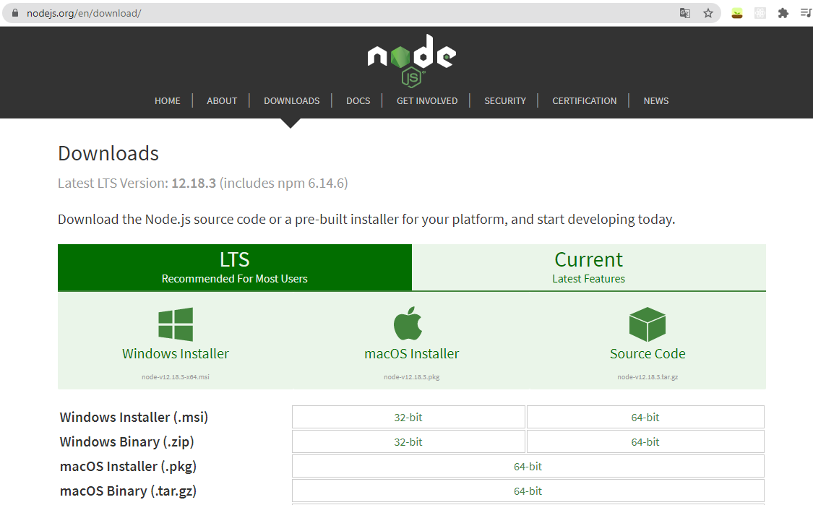
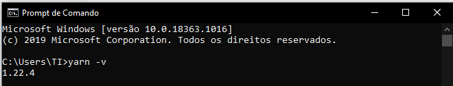

# workshop-react-consuming-api

## O que é React?

O React é uma biblioteca JavaScript de código aberto com foco em criar interfaces de usuário em páginas web. É mantido pelo Facebook, Instagram, outras empresas e uma comunidade de desenvolvedores individuais. É utilizado nos sites da Netflix, Imgur, Feedly, Airbnb, SeatGeek, HelloSign, Walmart e outros. Se preferir [clique aqui](https://www.youtube.com/watch?v=cEczlv669Oo) para assistir a um video e ter mais informações sobre React. 


Aqui está o link do repositório do projeto: [https://github.com/facebook/react](https://github.com/facebook/react).

## Preparação do ambiente

A primeira coisa que precisamos fazer antes de iniciar nosso projeto é garantir que temos o [NodeJs](https://nodejs.org/en/download/) instalado em nosso sistema**.** Para isto, abra um terminal **Ctrl + R** e digite `cmd` agora no seu prompt de comando digite `node -v` assim saberemos qual a versão do node instalada. Caso, retorne um erro significará que o NodeJs não está instalado, então [clique aqui](https://nodejs.org/en/download/) e baixe o NodeJs versão LTS, conforme seu sistema operacional e instale na sua máquina. Para instalar o Node é só dar next, next e finish. =\) 😉 Após a instalação concluída, repita a operação para verificar a versão.


Pronto! O NodeJs foi instalado com sucesso! 🥳 🎉 



O próximo passo é instalar a IDE para fazer o código do nosso projeto, caso não tenha instalado em sua máquina [clique aqui](https://code.visualstudio.com/download) para baixar o VSCode. 


 Uma vez instalado o VSCode, vamos criar o nosso projeto. 

O NodeJs tem seu próprio gerenciador de dependências, ele nos permite instalar outros pacotes que iremos precisar no nosso projeto. O Yarn também é um gerenciador de dependências.

Primeiro, abra um prompt de comando, digite ou copie o comando abaixo:

```text
npm install -g yarn
```

Agora você pode conferir a versão do yarn digitando `yarn -v`



Vamos usar o comando a seguir para instalar o gerador de aplicativos do React. Se quiser saber mais sobre o `create-react-app` pode conferir a documentação [aqui](https://create-react-app.dev/).

`yarn global add create-react-app`


[JSON](https://www.json.org/json-en.html) 

[https://jsonplaceholder.typicode.com/](https://jsonplaceholder.typicode.com/)


























```

```





























```

```





























```

```







Get Cakes



This endpoint allows you to get free cakes.






ID of the cake to get, for free of course.





Authentication token to track down who is emptying our stocks.





The API will do its best to find a cake matching the provided recipe.



Whether the cake should be gluten-free or not.







Cake successfully retrieved.


```
{    "name": "Cake's name",    "recipe": "Cake's recipe name",    "cake": "Binary cake"}
```




Could not find a cake matching this query.


```
{    "message": "Ain't no cake like that."}
```






